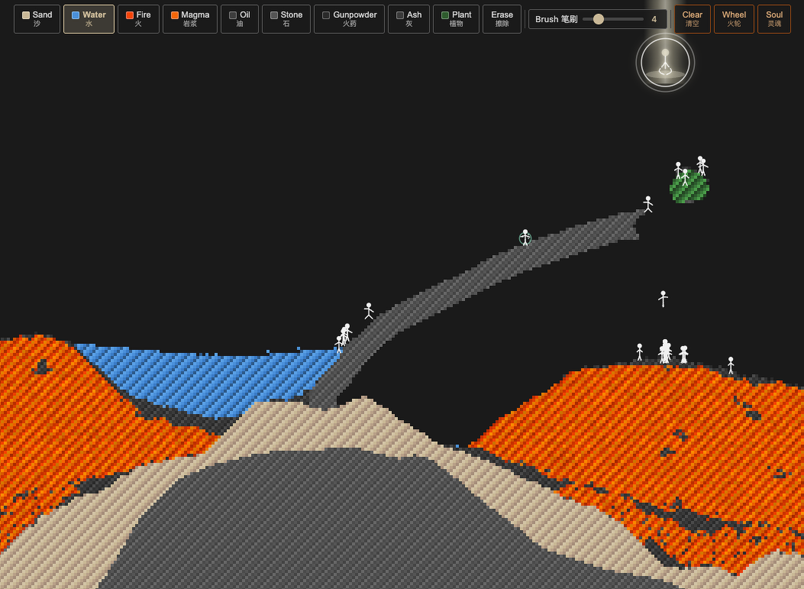

<div align="center">

# Sand Samsara · 沙界轮回

A formless realm constructed of particles and dust. All beings drift with karma; every destiny unfolds by conditions alone.

**▶ Play Online: <https://drhycheung.github.io/SandSamsara/>**

English ｜ [简体中文](README.md)

</div>

---

## Opening Statement & Creative Provenance

Sand Samsara is a modern artistic reimagining of the 2005 classic particle sandbox game *Hell of Sand*. All karmic and samsara-themed mechanics are creative artistic interpretations, not orthodox religious doctrine. There is no in-game text or storyline. This documentation only provides background context for interested readers.

---

## Worldview & Gameplay



*Sand Samsara* is a falling-particle sandbox art piece that builds a nameless realm from dust and particles. You are no mere spectator but an external condition within this world: you can place sand, water, fire, magma and other substances to reshape the terrain and its circumstances, or step back and watch stick-figure beings struggle, survive and cycle through rebirth.

All beings are born in a state of innocence, carrying no memory of past lives, knowing nothing of samsara and unable to grasp causation. Their temperaments differ: some drift numbly through muddled days; some rush restlessly after water and fertile ground; others struggle simply to avoid the suffering before them. They try to find peace by changing their outward circumstances, yet remain trapped in ignorance and attachment.

Beings are driven by **greed** and **fear**. Greed draws them toward lush greenery and the water's edge; the stronger the craving, the more readily they ignore danger to reach the shade. When two greedy hearts covet the same refuge, rivalry can become shoving and open combat, sometimes ending in death. Fear makes them recoil from fire and flee molten rock; the more timid they are, the sooner they sense danger and the faster they run, colliding with one another in panic. Fighting for what cannot be obtained and fleeing what might be lost, every pursuit and escape remains bound to attachment.

Death is never the end. Whether consumed by flame or magma, drowned in water, or killed by their own kind, the dead are immediately reborn. One life leaves as another arrives, birth and death following one another without pause: the most direct expression of samsara.

The realm is also haunted by the **Wheel of Karmic Fire**, the embodiment of collective unwholesome karma. It traverses the world on its own, but the player can also drag and steer it. The more beings drawn into its pull, the heavier the collective karma becomes and the larger the wheel grows. As it expands, beings are pressed toward the world's edges, where border flames arise and seal off their escape. When the wheel's expansion reaches its limit, the world collapses: fire sweeps across the realm, particles scatter, and the entire Sand Realm burns away.

Destruction is not punishment but the inevitable result of causes and conditions converging. After a brief stillness, the world resets and another generation of unknowing beings is born: without memory, without a past, the cycle begins again.

In this endless turning of samsara, most beings drift with their karma, struggle in vain, and eventually vanish with the world. A rare few can let go of fear, the craving for survival and every restless pursuit of the outer world, becoming serene and unmoving within themselves. In that state, awakening may occur: the body becomes golden radiance and slowly rises beyond the realm, leaving the cycle of rebirth forever. Such liberation is exceedingly rare; many cycles pass without a single being escaping.

You may shape the realm, place elements and steer the wheel, becoming one link among countless causes and conditions. Yet you cannot command the karma of any being or awaken on its behalf. Every being carries its own karma and destiny; the player's intervention is only one external condition among many. All fates — drifting, ruin, destruction and transcendence — arise from innumerable causes converging, and every destiny can only be met with acceptance.

The game contains no written story, prompts or narration. Players can only observe the world's patterns and contemplate its underlying nature. This README is an external supplement for readers interested in the project's creative background and worldview; it is not part of the in-game experience.

---

## Controls

| Action | Effect |
|--------|--------|
| Left-click / drag on empty ground | Draw the selected element (sand, water, fire, magma, oil, stone, gunpowder, ash, plant) |
| Left-click and hold a stick figure | Drag that being; it is briefly stunned after release |
| Left-click and hold the Wheel of Karmic Fire | Steer the wheel; on release it resumes wandering on its own |
| Right-click (hold and drag) | Cut plants (they turn to ash) |
| Touch devices | A single finger acts as the left button: draw elements, drag beings or steer the wheel; the canvas and controls adapt to phones/tablets |
| Toolbar at the top | Switch elements, adjust brush size, clear the world, summon the wheel manually, add a new soul |

---

## Run & Deployment Guide

### Local Quick Start (Zero Configuration)

This is a pure static single-file web project with no backend, dependencies, or compilation required. After downloading all project files, simply double-click the `index.html` file in the root directory to launch the game directly in your default browser. All mainstream browsers are supported.

You can also serve the project locally with Python. Run this from the project root:

```bash
python3 -m http.server 8000
```

Then open `http://localhost:8000` to play, and press `Ctrl+C` to stop the server. Other devices on the same local network can access it via `http://<your-local-ip>:8000`.

### GitHub Pages Deployment

The project is deployed live via GitHub Pages: **<https://drhycheung.github.io/SandSamsara/>**

To deploy your own copy:

1. Fork this repository to your GitHub account, or push your own copy
2. Open the repository page, then go to **Settings → Pages**
3. Under **Build and deployment**, set **Source** to **Deploy from a branch**
4. Select the `master` (or `main`) branch with the `/ (root)` directory, then click **Save**
5. After 1–2 minutes of building, the site will be available at `https://<username>.github.io/<repository-name>/`

### Vercel Deployment

1. Log in to [Vercel](https://vercel.com) and click **Add New → Project**
2. Import this project's GitHub repository
3. Keep the default settings (Framework Preset: **Other**) and click **Deploy**
4. Once deployed, access it via the assigned Vercel domain, or bind a custom domain as needed

### Nginx / Apache Deployment

Upload all project files to your server's web root — no extra configuration required:

- **Nginx**: place the files in `/usr/share/nginx/html/` (or your configured `root` directory)
- **Apache**: place the files in `/var/www/html/`
